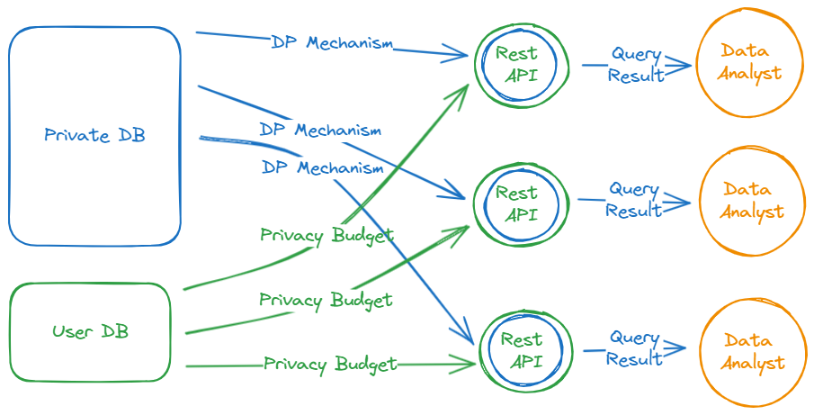

# diff_privacy_snowflake
### An SQL based differentially private interface

This is a Flask based differential privacy application.
It is intended to fit as an interface on top of a Snowflake Database and will return differentially private responses to a specified set of queries.
The DP theory is based upon the following textbook: https://programming-dp.com/book.pdf

## Summary

A user that would like to gain insights from the data needs access to aggregations (sums, averages, medians, etc.) of the data as well as samples (top K rows) from the data.
The data owner would like to not expose private information to the user.
These two requirements seem to conflict, but they can be solved with privacy technologies like synthetic data for samples and differentially private mechanisms for aggregates.
The database must keep track of (and also cap) it's users' consumption of privacy (also known as the privacy budget).
To ensure, that the user gets what they need and the data owner can retain the privacy of their data, the data owner must also know what the user is querying to prevent attacks on the data.

## Architecture

At the heart of the Architecture is the private DB. It contains private Information that the owner does not want to leak.
In this project, the private DB is hosted on Snowflake. The REST API built with Flask and Snowpark accesses the Private DB via a Snowflake technical Users that has Data access.
The API exposes only queries enveloped by privacy mechanisms. These privacy mechanisms have a "privacy cost".
The amount that a query costs will be subtracted from the technical user's privacy budget. 
When an API request is made, the API first reads the privacy budget from the Users DB. Once the privacy budget of the technical user is spent, an API call will not return any data.
The differentially private query result is returned to the user.

Upsides:
1. There is a centrally managed Users DB that tracks each user's privacy budget.
2. It is a zero trust system in regard to the data analyst. The analyst can use the API however they want.
3. The privacy budget updates are made atomically and are robust 

Downsides:
1. Snowflake is an expensive platform and not intended for OLTP workloads like the privacy budget updates.
2. The privacy mechanisms are implemented in Python/Snowpark with DataFrames, which is a less popular tool than SQL
3. A Rest API call makes two queries and an update to the database. This might be too much in one call.
4. A Rest API service is required for each user, since the API service is mapped to a single user with a privacy budget.

Future Ideas:
1. Implement the Rest API as an interface to multiple different types of databases
2. Implement the Mechanisms in SQL with Python as post-processing steps to implement the mechanism
3. 

## Usage

1. Sign up for a Snowflake account and set up your data (you can sign up for a free trial account)
   1. The data being used here is the titanic training data from: https://www.kaggle.com/c/titanic/data
2. Follow the setup from https://quickstarts.snowflake.com/guide/build_a_custom_api_in_python/index.html?index=..%2F..index#10
   1. Run the following to start the REST API service:
    >python api/src/app.py 
4. Check the API doc for the possible commands that can be run
